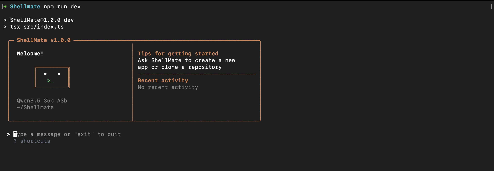

# ShellMate 🐚

A lightweight, educational AI coding assistant that runs directly in your terminal. Built to understand the core building blocks of modern terminal AI tools like Claude Code, GitHub Copilot CLI, and Warp AI.



## 🎯 Overview

ShellMate is a TypeScript-based terminal AI assistant that demonstrates the fundamental architecture of AI-powered coding tools. It features a clean REPL interface, tool-based AI interactions, and streaming responses via OpenRouter's API.

### Key Features

- 💬 **Interactive REPL**: Real-time streaming chat interface built with React and Ink
- 🛠️ **Tool System**: Extensible tool framework with 6 core tools for file operations and shell commands
- 🔄 **Streaming Responses**: Token-by-token streaming for responsive user experience
- 🎨 **Colorized Output**: Syntax-highlighted tool calls and results
- 🔌 **OpenRouter Integration**: Access to multiple AI models (Claude, GPT-4, etc.)
- 📦 **TypeScript**: Fully typed codebase with strong type safety

## 🏗️ Architecture

```
src/
├── api/          # OpenRouter API client and types
├── core/         # Core conversation logic and message loop
├── tools/        # Tool implementations (bash, read, write, edit, glob, grep)
├── ui/           # React/Ink UI components (REPL, MessageList, TextInput)
└── utils/        # Utility functions (colors, formatting)
```

### Components

1. **API Layer** (`api/`)
   - `client.ts`: Streaming chat completion client for OpenRouter
   - `types.ts`: TypeScript definitions for chat messages and tool calls

2. **Core Logic** (`core/`)
   - `messageLoop.ts`: Orchestrates multi-turn conversations with tool execution
   - `systemPrompt.ts`: Generates context-aware system prompts
   - `toolExecutor.ts`: Executes tool calls and handles results
   - `query.ts`: Conversation state management

3. **Tool System** (`tools/`)
   - `bash.ts`: Execute shell commands with timeout support
   - `read.ts`: Read files with line numbers and pagination
   - `write.ts`: Create or overwrite files with directory creation
   - `edit.ts`: Replace exact string matches in files
   - `glob.ts`: Find files matching glob patterns
   - `grep.ts`: Search file contents using regex (ripgrep/grep)

4. **UI Layer** (`ui/`)
   - `REPL.tsx`: Main REPL component with state management
   - `MessageList.tsx`: Displays conversation history with streaming
   - `TextInput.tsx`: User input component
   - `ToolResult.tsx`: Formatted tool execution results

## 🚀 Getting Started

### Prerequisites

- Node.js 18+ 
- npm or yarn
- OpenRouter API key ([get one here](https://openrouter.ai/))

### Installation

```bash
# Clone the repository
git clone <your-repo-url>
cd Shellmate

# Install dependencies
npm install

# Set up environment variables
cp .env.example .env
# Edit .env and add your OPENROUTER_API_KEY
```

### Running Shellmate

```bash
# Development mode with hot reload
npm run dev

# Build for production
npm run build

# Run production build
npm start

# Or use the CLI command directly (after build)
cc
```

### Usage

```bash
# Start with default model (Claude Sonnet 4)
cc

# Use a specific model
cc --model anthropic/claude-3.5-sonnet

# Example queries:
> List all TypeScript files in the current directory
> Read the package.json file and explain the dependencies
> Create a hello world script in Python
> Search for TODO comments in the codebase
```

## 🛠️ Available Tools

ShellMate provides 6 core tools that the AI can use:

| Tool | Description | Use Cases |
|------|-------------|-----------|
| **bash** | Execute shell commands | Running scripts, installing packages, git operations |
| **read** | Read file contents with line numbers | Viewing code, configuration files |
| **write** | Create or overwrite files | Generating new files, scripts, configs |
| **edit** | Replace exact string matches | Precise code modifications, refactoring |
| **glob** | Find files by pattern | File discovery, listing source files |
| **grep** | Search file contents | Finding code patterns, TODOs, function definitions |

## 📚 Technical Details

### How It Works

1. **User Input**: User types a message in the terminal REPL
2. **API Request**: Message sent to OpenRouter with available tools and system context
3. **Streaming Response**: AI response streams token-by-token to the UI
4. **Tool Execution**: If AI calls tools, they execute locally and results are shown
5. **Continuation**: Results fed back to AI for additional turns until completion

### Tool Call Flow

```
User Message → AI Response (with tool calls)
                   ↓
            Execute Tools Locally
                   ↓
            Results → AI (next turn)
                   ↓
         Final Response to User
```

### Technology Stack

- **Runtime**: Node.js with ES Modules
- **Language**: TypeScript
- **UI Framework**: React with Ink (terminal UI)
- **CLI Framework**: Commander.js
- **Validation**: Zod with JSON Schema generation
- **API**: OpenRouter (streaming chat completions)
- **Utilities**: Chalk, glob, dotenv

## 🔧 Configuration

### Environment Variables

Create a `.env` file:

```bash
OPENROUTER_API_KEY=your_key_here
```

### Model Selection

ShellMate supports any model available on OpenRouter:

```bash
# Claude models
cc --model anthropic/claude-sonnet-4
cc --model anthropic/claude-3.5-sonnet

# OpenAI models
cc --model openai/gpt-4-turbo
cc --model openai/gpt-4o

# Other models
cc --model google/gemini-pro
cc --model meta-llama/llama-3-70b
```

## 📖 Learning Resources

This project demonstrates several key concepts:

- **Streaming AI Responses**: Server-Sent Events (SSE) parsing and token streaming
- **Tool/Function Calling**: OpenAI-compatible tool definitions and execution
- **Terminal UI**: Building interactive CLIs with React and Ink
- **Conversation Management**: Multi-turn conversations with tool integration
- **Type Safety**: End-to-end TypeScript with Zod validation

## 🧪 Development

```bash
# Run in development mode (hot reload)
npm run dev

# Build TypeScript
npm run build

# Type checking
npx tsc --noEmit
```

## 🤝 Contributing

This is an educational project to understand AI coding assistants. Feel free to:

- Add new tools to the `src/tools/` directory
- Enhance the UI components
- Improve the system prompt
- Add support for different AI providers
- Experiment with different conversation strategies

## 📝 Project Structure

```
Shellmate/
├── src/
│   ├── api/              # API client and types
│   │   ├── client.ts     # OpenRouter streaming client
│   │   └── types.ts      # Chat and tool types
│   ├── core/             # Core conversation logic
│   │   ├── messageLoop.ts    # Multi-turn conversation orchestration
│   │   ├── systemPrompt.ts   # System prompt generation
│   │   ├── toolExecutor.ts   # Tool execution engine
│   │   └── query.ts          # Conversation state
│   ├── tools/            # Tool implementations
│   │   ├── bash.ts       # Shell command execution
│   │   ├── read.ts       # File reading
│   │   ├── write.ts      # File creation/overwriting
│   │   ├── edit.ts       # String replacement editing
│   │   ├── glob.ts       # File pattern matching
│   │   ├── grep.ts       # Content search
│   │   └── index.ts      # Tool registry
│   ├── ui/               # Terminal UI components
│   │   ├── App.tsx       # Main app component
│   │   ├── REPL.tsx      # REPL logic and state
│   │   └── components/   # UI subcomponents
│   ├── utils/            # Utilities
│   │   └── colors.ts     # Color formatting
│   ├── index.ts          # CLI entry point
│   └── main.ts           # Commander CLI setup
├── package.json
├── tsconfig.json
└── .env                  # API key configuration
```

## 🔐 Security

- Never commit your `.env` file with API keys
- API keys are loaded from environment variables only
- Tool execution happens in the current directory context
- No automatic file uploads or external data sharing

## 📄 License

MIT License - Feel free to use this for learning and experimentation.

## 🙏 Acknowledgments

This project was built to understand and learn from:
- **Claude Code**: Anthropic's AI coding assistant
- **GitHub Copilot CLI**: GitHub's terminal AI helper
- **Warp AI**: AI-integrated terminal emulator

Inspired by their architectures but simplified for educational purposes.

## 🐛 Known Limitations

- No async/background command support
- No file watching or hot reload
- Limited context window management
- No multi-session/multi-file diffs
- Basic error handling without retries
- No conversation history persistence
- Single-threaded tool execution

See [FEATURES_COMPARISON.md](./FEATURES_COMPARISON.md) for detailed feature gaps.

## 📧 Contact

Built by Ram Krishna Yadav as a learning project to understand terminal AI assistants.

---

**Note**: This is an educational project. For production use, consider the official tools like GitHub Copilot CLI or Claude Code.
